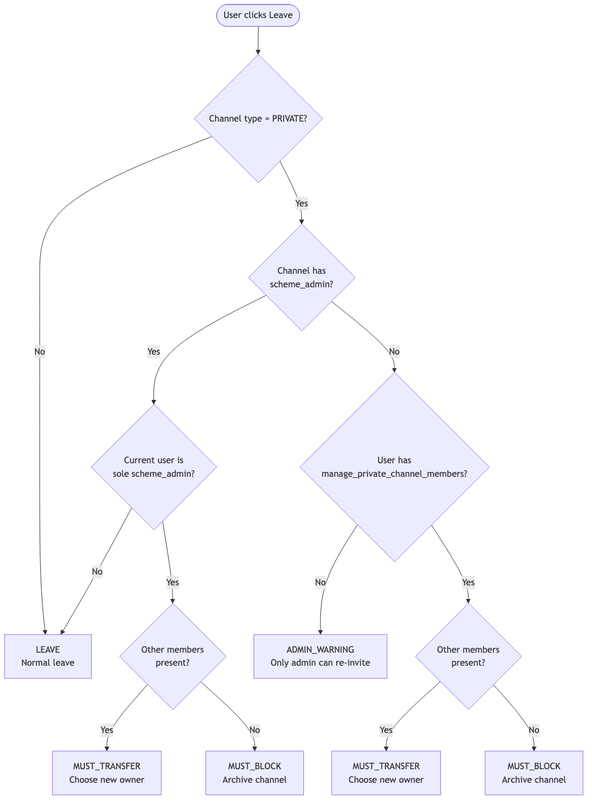

# Leave Private Channel Logic

This document describes the decision flow when a user attempts to leave a private channel.

## Decision Flow



<details>
<summary>Source diagram (Mermaid)</summary>

```mermaid
flowchart TD
    Start([User clicks Leave]) --> CheckPrivate{Channel type = PRIVATE?}
    CheckPrivate -->|No| Leave[LEAVE<br/>Normal leave without popup]
    CheckPrivate -->|Yes| CheckChannelAdmins{Channel has<br/>scheme_admin?}
    
    CheckChannelAdmins -->|Yes| IsLastAdmin{Current user is<br/>sole scheme_admin?}
    IsLastAdmin -->|No| Leave
    IsLastAdmin -->|Yes| HasOthers1{Other members<br/>present?}
    HasOthers1 -->|Yes| Transfer1[MUST_TRANSFER<br/>Popup: choose new owner]
    HasOthers1 -->|No| Block1[MUST_BLOCK<br/>Popup: archive channel]
    
    CheckChannelAdmins -->|No| IsProductAdmin{Current user has<br/>MANAGE_PRIVATE_CHANNEL_MEMBERS<br/>via team role?}
    IsProductAdmin -->|No| Warning[ADMIN_WARNING<br/>Popup: "Only an admin<br/>can re-invite you"]
    IsProductAdmin -->|Yes| HasOthers2{Other members<br/>present?}
    HasOthers2 -->|Yes| Transfer2[MUST_TRANSFER<br/>Popup: choose new owner]
    HasOthers2 -->|No| Block2[MUST_BLOCK<br/>Popup: archive channel]
```

</details>

## Rules Summary

### Admin Canal (scheme_admin)

If the channel still has channel admins (`scheme_admin = true`):

| Condition | Resulting Constraint | Popup |
|---|---|---|
| Current user is **not** the only `scheme_admin` | `LEAVE` | None |
| Current user is the **only** `scheme_admin` + other members exist | `MUST_TRANSFER` | Transfer ownership |
| Current user is the **only** `scheme_admin` + no other members | `MUST_BLOCK` | Archive channel |

### Admin Produit (team role with `manage_private_channel_members`)

If the channel has **zero** channel admins (e.g., kicked from organization):

| Condition | Resulting Constraint | Popup |
|---|---|---|
| Current user is **not** a team admin with the permission | `ADMIN_WARNING` | "Only an admin can re-invite you" |
| Current user **is** team admin + other members exist | `MUST_TRANSFER` | Transfer ownership |
| Current user **is** team admin + no other members | `MUST_BLOCK` | Archive channel |

## Notes

- The count of other members is derived from `membersInChannel` and `profilesInChannel`, filtered to exclude deleted accounts, bots, and guests. This ensures the transfer UI only offers selectable human users.
- Users with `delete_at !== 0` (deleted accounts) are filtered out from the member count.
- The data fetch (`loadProfilesAndReloadChannelMembers` + `getChannelStats`) happens in the `requestLeaveChannel` action **before** the modal opens, ensuring the member list is available when the popup renders.
